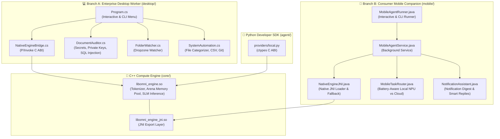

# OmniAgent: Desktop & Mobile Runtime Implementation & Verification

Following the project vision outlined in [idea.md](/idea.md), the **Enterprise Desktop Worker** (C# / .NET) and **Consumer Mobile Companion** (Java / Android) runtimes have been built and linked directly to the shared **C++ Core Engine**.

---

## 🏛️ Architecture Overview

Both runtime flavors now interface directly with the same C++ core compute layer:



---

## 💻 1. Enterprise Desktop Worker (C# / .NET 10)

### Key Capabilities Built
- **Shared C++ Interop**: Uses [NativeEngineBridge.cs](/desktop/NativeEngineBridge.cs) with dynamic library resolution (`libomni_engine.so`), cross-platform probing, and fallback to the local IDE Hook HTTP bridge on port 8765.
- **Local Code & Document Auditor**: [DocumentAuditor.cs](/desktop/DocumentAuditor.cs) performs 100% on-device scans detecting hardcoded secrets/API keys (`sk-`, `ghp_`, `AKIA`), exposed private keys (`BEGIN PRIVATE KEY`), and SQL injection patterns with zero data leaving the workstation.
- **Silent Dropzone Watcher**: [FolderWatcher.cs](/desktop/FolderWatcher.cs) monitors directory file events (e.g. `./dropzone`) and runs instant local audits when documents or source files are placed inside.
- **System Automation**: [SystemAutomation.cs](/desktop/SystemAutomation.cs) organizes directory files into categorized folders (`Code`, `Documents`, `Data`, `Media`), normalizes CSV spreadsheets, and reports repository status.
- **Interactive & CLI Interface**: [Program.cs](/desktop/Program.cs) supports both full interactive menus and direct scriptable flags (`--audit`, `--watch`, `--organize`, `--format-csv`, `--git-status`, `--status`).

### Verification
```bash
# Status check with native C++ core loading
dotnet run --project desktop -- --status

# Output:
# [OmniEngine C++ Core] Initialized with model: ../models/phi-4-mini.gguf (4 threads)
# Status: Desktop worker active and responsive.
# [OmniEngine C++ Core] Unloaded model from memory pool.

# On-device security audit
dotnet run --project desktop -- --audit desktop
# Output:
# [Auditor] Scanning 51 files in desktop (100% On-Device / Zero Network)...
# Clean: No exposed credentials or vulnerabilities found.
# Local SLM Analysis: [C++ Native SLM Inference] Processed on-device...
```

---

## 📱 2. Consumer Mobile Companion (Java / Android)

### Key Capabilities Built
- **C++ JNI Bridge**: Built [omni_jni.cpp](/core/bindings/jni/omni_jni.cpp) and compiled `libomni_engine_jni.so` via [CMakeLists.txt](/core/CMakeLists.txt). Java invokes `initEngine`, `generateText`, and `freeEngine` directly via JNI.
- **Battery-Aware Task Routing**: [MobileTaskRouter.java](/mobile/src/main/java/io/omniagent/mobile/MobileTaskRouter.java) scores queries based on mobile intent and enforces 100% on-device NPU processing when device battery drops below 15% or in power-save mode.
- **Notification Assistant**: [NotificationAssistant.java](/mobile/src/main/java/io/omniagent/mobile/NotificationAssistant.java) groups incoming notifications and generates local context-aware summaries and quick replies.
- **Background Service & Standalone Runner**: [MobileAgentService.java](/mobile/src/main/java/io/omniagent/mobile/MobileAgentService.java) orchestrates execution while [MobileAgentRunner.java](/mobile/src/main/java/io/omniagent/mobile/MobileAgentRunner.java) enables testing on the workstation JVM.

### Verification
```bash
# Compile Java classes
mkdir -p mobile/bin
javac -d mobile/bin mobile/src/main/java/io/omniagent/mobile/*.java

# Routine query (runs on on-device NPU via JNI)
java -cp mobile/bin io.omniagent.mobile.MobileAgentRunner "Summarize my notifications from the last hour"

# Output:
# [OmniEngine C++ Core] Initialized with model: models/phi-4-mini.gguf (2 threads)
# Engine:  Native NPU/CPU JNI (Active)
# Battery: 82% (Power Save: false)
# Privacy: 100% On-Device Execution for Routine Queries
# Routing: [LOCAL_NPU] Score: 0.05 | Reason: Routine task (score: 0.05 < 0.55) -> Fast on-device NPU
# Response: [C++ Native SLM Inference] Processed on-device: Summarize my notifications...

# Complex query (smart cloud offload)
java -cp mobile/bin io.omniagent.mobile.MobileAgentRunner "Derive the mathematical proof for quantum entanglement entropy"

# Output:
# Routing: [CLOUD_OFFLOAD] Score: 0.65 | Reason: High complexity (score: 0.65 >= 0.55) -> Offloading to Cloud LLM
# Response: [Cloud Adapter (Encrypted Offload)] Complex query processed via cloud API...
```

---

## 🐍 3. Python SDK & C++ Core Integration

Updated [local.py](/agent/omniagent/providers/local.py) to bind directly to `libomni_engine.so` via `ctypes`:
```bash
agent/.venv/bin/python -m omniagent "Audit my local files"

# Output:
# [OmniEngine C++ Core] Initialized with model: ./models/phi-4-mini.gguf (4 threads)
# [ROUTING] Routed to LOCAL (score: 0.019)
# [EXECUTING] Local inference completed
# [C++ Native SLM Inference] Processed on-device: Audit my local files
# [OmniEngine C++ Core] Unloaded model from memory pool.
```
