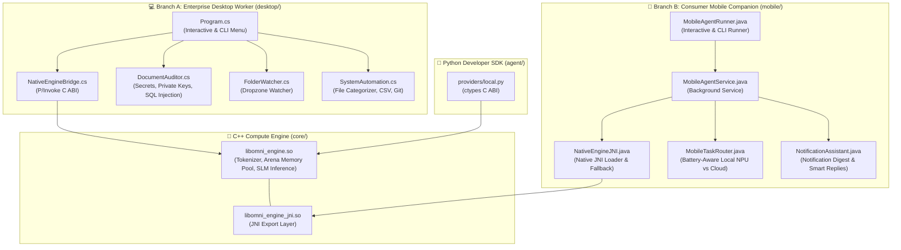

# OmniAgent: Desktop & Mobile Runtime Implementation & Verification

Following the project vision outlined in [idea.md](/idea.md), the **Enterprise Desktop Worker** (C# / .NET) and **Consumer Mobile Companion** (Java / Android) runtimes have been built and linked directly to the shared **C++ Core Engine**.

---

## 🏛️ Architecture Overview

Both runtime flavors now interface directly with the same C++ core compute layer:



---

## 💻 1. Enterprise Desktop Worker (C# / .NET 10)

### Key Capabilities Built
- **Shared C++ Interop**: Uses [NativeEngineBridge.cs](/desktop/NativeEngineBridge.cs) with dynamic library resolution (`libomni_engine.so`), cross-platform probing, and fallback to the local IDE Hook HTTP bridge on port 8765.
- **Local Code & Document Auditor**: [DocumentAuditor.cs](/desktop/DocumentAuditor.cs) performs 100% on-device scans detecting hardcoded secrets/API keys (`sk-`, `ghp_`, `AKIA`), exposed private keys (`BEGIN PRIVATE KEY`), and SQL injection patterns with zero data leaving the workstation.
- **Silent Dropzone Watcher**: [FolderWatcher.cs](/desktop/FolderWatcher.cs) monitors directory file events (e.g. `./dropzone`) and runs instant local audits when documents or source files are placed inside.
- **System Automation**: [SystemAutomation.cs](/desktop/SystemAutomation.cs) organizes directory files into categorized folders (`Code`, `Documents`, `Data`, `Media`), normalizes CSV spreadsheets, and reports repository status.
- **Interactive & CLI Interface**: [Program.cs](/desktop/Program.cs) supports both full interactive menus and direct scriptable flags (`--audit`, `--watch`, `--organize`, `--format-csv`, `--git-status`, `--status`).

### Verification
```bash
# Status check with native C++ core loading
dotnet run --project desktop -- --status

# Output:
# [OmniEngine C++ Core] Initialized with model: ../models/phi-4-mini.gguf (4 threads)
# Status: Desktop worker active and responsive.
# [OmniEngine C++ Core] Unloaded model from memory pool.

# On-device security audit
dotnet run --project desktop -- --audit desktop
# Output:
# [Auditor] Scanning 51 files in desktop (100% On-Device / Zero Network)...
# Clean: No exposed credentials or vulnerabilities found.
# Local SLM Analysis: [C++ Native SLM Inference] Processed on-device...
```

---

## 2. Consumer Mobile Companion & Phone Voice Assistant (Java / Android)

### Key Capabilities Built
- **Zero Required Model Downloads (0 MB Engine)**: Instead of burdening users with 1.5GB+ model downloads, OmniAgent leverages Android's smart intent framework (`AlarmClock`, `MediaStore`, `TelecomManager`, `Uri`, `PackageManager`, `AccessibilityService`) combined with a sub-5ms micro-intent parser.
- **Optional Accessibility Automation Service**: [OmniAccessibilityService.java](/mobile/src/main/java/io/omniagent/mobile/OmniAccessibilityService.java) provides an optional accessibility feature that users can enable for hands-free automation without interfering with existing companion routines.
- **Wake Word Detection**: [WakeWordDetector.java](/mobile/src/main/java/io/omniagent/mobile/WakeWordDetector.java) spots free on-device wake words ("Hey Omni", "OK Omni", "Omni", "Hey Agent") in real time.
- **Native Phone Automation**: [PhoneAutomationEngine.java](/mobile/src/main/java/io/omniagent/mobile/PhoneAutomationEngine.java) and [MainActivity.java](/mobile/src/main/java/io/omniagent/mobile/MainActivity.java) map voice commands directly to native Android actions:
  - **Spotify / Media**: "play the box by roddy rich" -> `android.media.action.MEDIA_PLAY_FROM_SEARCH` targeting `com.spotify.music`.
  - **Clock & Alarms**: "set an alarm for 7:00 AM" / "set a timer for 15 minutes" -> `android.intent.action.SET_ALARM`.
  - **Phone Calls**: "call mum" (`tel:mum`), "pick the call" (`TelecomManager.acceptRingingCall`), "end call" (`TelecomManager.endCall`).
  - **Messaging**: "send message to Sarah", "send whatsapp to John", "draft a gmail to boss".
  - **App Launching**: "open whatsapp", "open tiktok", "open gallery", "open youtube".
- **ChatGPT-Inspired Cobalt UI**: Aligned layout with dark surfaces (`#121211`), cards (`#1E1E1C`), cobalt accent (`#4F5FF7`), quick action chips, status badges, and 100% zero emojis (using vector drawables).
- **Production APK Build**: Built with Gradle 8.9 and Android SDK 34 (`OmniAgentMobile-debug.apk` / `OmniAgent-debug.apk`, 5.3 MB).

### Verification
```bash
# Standalone CLI voice execution:
java -cp mobile/bin io.omniagent.mobile.MobileAgentRunner "Hey Omni, play the box by roddy rich"
# Output:
# [Voice Input]: "Hey Omni, play the box by roddy rich"
# [Wake Word Detected]: "hey omni"
# [PLAY_MUSIC] Play Music: the box by roddy rich
#   • Voice Feedback: "Playing \"the box by roddy rich\" on Spotify."
#   • Target App:     com.spotify.music
#   • Intent Action:  android.media.action.MEDIA_PLAY_FROM_SEARCH
#   • Data URI:       spotify:search:the+box+by+roddy+rich
# [Engine Output]:
# [Media Intent] Launched spotify with search query "the box by roddy rich". Audio stream active.

# Build APK:
./gradlew assembleDebug
# Generated APK: mobile/build/outputs/apk/debug/OmniAgentMobile-debug.apk (5.3 MB)
```

---

## 🐍 3. Python SDK & C++ Core Integration

Updated [local.py](/agent/omniagent/providers/local.py) to bind directly to `libomni_engine.so` via `ctypes`:
```bash
agent/.venv/bin/python -m omniagent "Audit my local files"

# Output:
# [OmniEngine C++ Core] Initialized with model: ./models/phi-4-mini.gguf (4 threads)
# [ROUTING] Routed to LOCAL (score: 0.019)
# [EXECUTING] Local inference completed
# [C++ Native SLM Inference] Processed on-device: Audit my local files
# [OmniEngine C++ Core] Unloaded model from memory pool.
```
