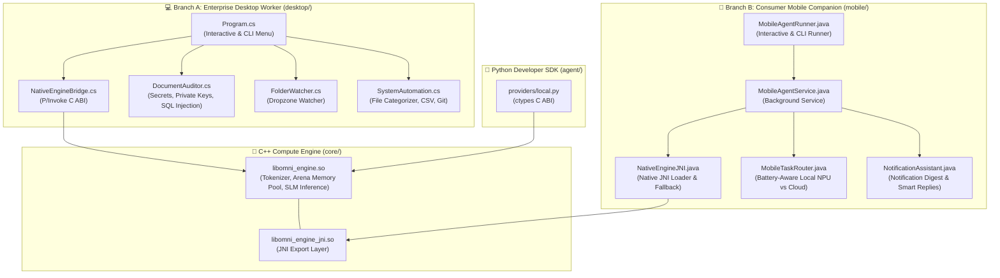

# OmniAgent: Desktop & Mobile Runtime Implementation & Verification

Following the project vision outlined in [idea.md](/idea.md), the **Enterprise Desktop Worker** (C# / .NET) and **Consumer Mobile Companion** (Java / Android) runtimes have been built and linked directly to the shared **C++ Core Engine**.

---

## 🏛️ Architecture Overview

Both runtime flavors now interface directly with the same C++ core compute layer:



---

## 💻 1. Enterprise Desktop Worker (C# / .NET 10)

### Key Capabilities Built

- **Shared C++ Interop**: Uses [NativeEngineBridge.cs](/desktop/NativeEngineBridge.cs) with dynamic library resolution (`libomni_engine.so`), cross-platform probing, and fallback to the local IDE Hook HTTP bridge on port 8765.
- **Local Code & Document Auditor**: [DocumentAuditor.cs](/desktop/DocumentAuditor.cs) performs 100% on-device scans detecting hardcoded secrets/API keys (`sk-`, `ghp_`, `AKIA`), exposed private keys (`BEGIN PRIVATE KEY`), and SQL injection patterns with zero data leaving the workstation.
- **Silent Dropzone Watcher**: [FolderWatcher.cs](/desktop/FolderWatcher.cs) monitors directory file events (e.g. `./dropzone`) and runs instant local audits when documents or source files are placed inside.
- **System Automation**: [SystemAutomation.cs](/desktop/SystemAutomation.cs) organizes directory files into categorized folders (`Code`, `Documents`, `Data`, `Media`), normalizes CSV spreadsheets, and reports repository status.
- **Interactive & CLI Interface**: [Program.cs](/desktop/Program.cs) supports both full interactive menus and direct scriptable flags (`--audit`, `--watch`, `--organize`, `--format-csv`, `--git-status`, `--status`).

### Verification

```bash
# Status check with native C++ core loading
dotnet run --project desktop -- --status

# Output:
# [OmniEngine C++ Core] Initialized with model: ../models/phi-4-mini.gguf (4 threads)
# Status: Desktop worker active and responsive.
# [OmniEngine C++ Core] Unloaded model from memory pool.

# On-device security audit
dotnet run --project desktop -- --audit desktop
# Output:
# [Auditor] Scanning 51 files in desktop (100% On-Device / Zero Network)...
# Clean: No exposed credentials or vulnerabilities found.
# Local SLM Analysis: [C++ Native SLM Inference] Processed on-device...
```

---

## 2. Consumer Mobile Companion & Phone Voice Assistant (Java / Android)

### Key Capabilities Built

- **Zero Required Model Downloads (0 MB Engine)**: Instead of burdening users with 1.5GB+ model downloads, OmniAgent leverages Android's smart intent framework (`AlarmClock`, `MediaStore`, `TelecomManager`, `Uri`, `PackageManager`, `AccessibilityService`) combined with a sub-5ms micro-intent parser.
- **Optional Accessibility Automation Service**: [OmniAccessibilityService.java](/mobile/src/main/java/io/omniagent/mobile/OmniAccessibilityService.java) provides an optional accessibility feature that users can enable for hands-free automation without interfering with existing companion routines.
- **Wake Word Detection**: [WakeWordDetector.java](/mobile/src/main/java/io/omniagent/mobile/WakeWordDetector.java) spots free on-device wake words ("Hey Omni", "OK Omni", "Omni", "Hey Agent") in real time.
- **Native Phone Automation**: [PhoneAutomationEngine.java](/mobile/src/main/java/io/omniagent/mobile/PhoneAutomationEngine.java) and [MainActivity.java](/mobile/src/main/java/io/omniagent/mobile/MainActivity.java) map voice commands directly to native Android actions:
  - **Spotify / Media**: "play the box by roddy rich" -> `android.media.action.MEDIA_PLAY_FROM_SEARCH` targeting `com.spotify.music`.
  - **Clock & Alarms**: "set an alarm for 7:00 AM" / "set a timer for 15 minutes" -> `android.intent.action.SET_ALARM`.
  - **Phone Calls**: "call mum" (`tel:mum`), "pick the call" (`TelecomManager.acceptRingingCall`), "end call" (`TelecomManager.endCall`).
  - **Messaging**: "send message to Sarah", "send whatsapp to John", "draft a gmail to boss".
  - **App Launching**: "open whatsapp", "open tiktok", "open gallery", "open youtube".
- **Consumer-Friendly Cobalt UI**: Intuitive, warm interface free of developer jargon. Clear cards for "Hands-Free Voice Assistant", "Assistant Setup", and "Recent Activity" displaying conversational feedback. 100% zero emojis with crisp vector icons.
- **Signed Production APK**: Built and signed with release keystore (`OmniAgentMobile-release.apk` / `OmniAgent-release.apk`, 4.4 MB, verified with APK Signature Scheme v2).

### Verification

```bash
# Standalone CLI voice execution:
java -cp mobile/bin io.omniagent.mobile.MobileAgentRunner "Hey Omni, play the box by roddy rich"
# Output:
# [Voice Input]: "Hey Omni, play the box by roddy rich"
# [Wake Word Detected]: "hey omni"
# [PLAY_MUSIC] Play Music: the box by roddy rich
#   • Voice Feedback: "Playing \"the box by roddy rich\" on Spotify."
#   • Target App:     com.spotify.music
#   • Intent Action:  android.media.action.MEDIA_PLAY_FROM_SEARCH
#   • Data URI:       spotify:search:the+box+by+roddy+rich
# [Engine Output]:
# [Media Intent] Launched spotify with search query "the box by roddy rich". Audio stream active.

# Build Signed Production APK:
./gradlew assembleRelease
# Output: mobile/build/outputs/apk/release/OmniAgentMobile-release.apk (v0.2.0, versionCode 4, 4.4 MB)
# Signature Verification: Verified using v2 scheme (APK Signature Scheme v2): true
```

---

## 🐍 3. Python SDK & C++ Core Integration

Updated [local.py](/agent/omniagent/providers/local.py) to bind directly to `libomni_engine.so` via `ctypes`:

```bash
agent/.venv/bin/python -m omniagent "Audit my local files"

# Output:
# [OmniEngine C++ Core] Initialized with model: ./models/phi-4-mini.gguf (4 threads)
# [ROUTING] Routed to LOCAL (score: 0.019)
# [EXECUTING] Local inference completed
# [C++ Native SLM Inference] Processed on-device: Audit my local files
# [OmniEngine C++ Core] Unloaded model from memory pool.
```

---

## 📦 4. Cross-Platform Release Packages Published (v0.2.1)

All packages have been built, packaged into self-contained archives/installers, and uploaded directly to [GitHub Release v0.2.1](https://github.com/kingjethro999/OmniAgent/releases/tag/v0.2.1):

| Component                             | Target Platform     | Format                          | Asset File                                            |
| :------------------------------------ | :------------------ | :------------------------------ | :---------------------------------------------------- |
| **Android Assistant & Voice Match**   | Android 8.0+        | Signed APK (Scheme v2)          | `OmniAgent-v0.2.1-Android.apk` (4.4 MB)               |
| **Desktop Voice Assistant (Linux)**   | Linux x86_64        | Self-Contained + C++ Core       | `OmniAgent-Desktop-linux-x64-v0.2.1.tar.gz` (31.0 MB) |
| **Desktop Voice Assistant (Windows)** | Windows 10/11 x64   | Single-File Executable (`.exe`) | `OmniAgent-Desktop-win-x64-v0.2.1.zip` (31.0 MB)      |
| **Main Omni Engine Core**             | Linux C / C++ / JNI | C Headers, CMake & `.so`        | `omniagent-engine-linux-x64-v0.2.1.tar.gz` (27.0 KB)  |
| **Python SDK Wheel**                  | Python 3.10+        | Standalone Wheel                | `omniagent-0.2.1-py3-none-any.whl` (38.0 KB)          |
| **Python Source Distribution**        | Python 3.10+        | Standard Source Tarball         | `omniagent-0.2.1.tar.gz` (60.0 KB)                    |

---

## 🎙️ 5. Autonomous Desktop Desktop GUI Assistant & Voice Match Calibration (v0.2.1)

### Native Desktop GUI Assistant (Windows & Linux - Not Terminal Only!)

- **Native GUI Window Architecture**: [DesktopGuiWindow.cs](/desktop/DesktopGuiWindow.cs) hosts a frameless, glassmorphic, floating Voice HUD window using `Photino.NET` (WebKitGTK on Linux, WebView2 on Windows) that stays on top of all active workstation windows without requiring a terminal.
- **Glowing voice orb & Waveform Visualizer**: Features an animated multi-layer radial gradient orb (Cobalt `#4F5FF7`, Cyan `#00F0FF`, Purple `#8A2BE2`) that gently breathes when idle, pulses brightly with active soundwave frequency bars when listening, and ripples during speech.
- **One-Click OS Installers**:
  - `install.sh`: Installs executable to `~/.local/bin/omniagent`, icon to `~/.local/share/icons/`, and `.desktop` entry to `~/.local/share/applications/omniagent.desktop`. Appears directly in GNOME Dash and KDE Application Menu.
  - `install.ps1`: Registers OmniAgent in Windows Start Menu and auto-starts on login.
- **Wake Word Call-out**: Continuous low-overhead background listening spots _"Hey Omni"_ or _"OK Omni"_ and brings up the floating GUI overlay with real-time speech transcription.
- **Interactive Action Cards**:
  - _Spotify Player Card_: Track title, artist, live play/pause toggle, skip, and volume slider.
  - _Hardware Telemetry Gauges_: Real-time progress bars for CPU load, RAM usage, and storage space.
  - _Animated Timers & Alarms_: Visual circular countdown with chime and notification alarms.
  - _App Launcher_: Opens Chrome, VS Code, Terminal, Calculator, Steam, and File Manager.
  - _System Controls_: Workstation lock (`loginctl lock-session` / Windows `LockWorkStation`), volume adjustment, and full-screen screenshot capture.
  - _Local SLM Fallback_: Conversational queries routed locally to the C++ Core (`libomni_engine.so`) with zero privacy leakage.
- **Personalized Voice Match & Accent Calibration**: Interactive GUI wizard tab allowing users to record 4 calibration phrases to tune acoustic energy thresholds and phonetic distance tolerance for their unique vocal pitch and accent.

### Android Mobile Voice Match (Pure Java Architecture)

- **Why Pure Java for Low-Level Audio**: Mobile audio capture and wake-word spotting are built in pure Java (`AudioRecord`, `MediaRecorder.AudioSource.VOICE_RECOGNITION`, 16kHz mono PCM buffers). This provides direct, transparent access to Android's native audio pipeline with zero foreign library bloat or expensive cloud SDKs (such as Picovoice or ONNX).
- **Personal Accent Calibration (Card 3B)**: [VoiceProfileManager.java](/mobile/src/main/java/io/omniagent/mobile/VoiceProfileManager.java) guides the user through 4 spoken calibration phrases ("Hey Omni", "OK Omni", "Hey Omni, play music", "Hey Omni, what's the weather today?"), profiling acoustic energy and personal tone.
- **Phonetic Distance Matching**: [WakeWordDetector.java](/mobile/src/main/java/io/omniagent/mobile/WakeWordDetector.java) combines acoustic thresholds with Levenshtein phonetic distance tolerance, reliably recognizing user intent regardless of accent or regional dialect.
